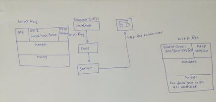

# Movies-Library

# Movies-Library - 02v

**Author Name**: khadyjh AL-abbadi

## WRRC

## Overview

## Getting Started
first you need to clone it in your local machine then install the required packages from the terminal using npm command 
then you need to open vs code to start coding by define the installed packages by using require() method 
 -  const express=require('express');
  - const cors=require('cors'); 

   then create server using the express by:
   - const server=express();

   then define the get method to send the data 

## Project Features
no features yet it just use the get method to send data to the user 
use api to fitch data from it then send it to the browser using async methode like axios