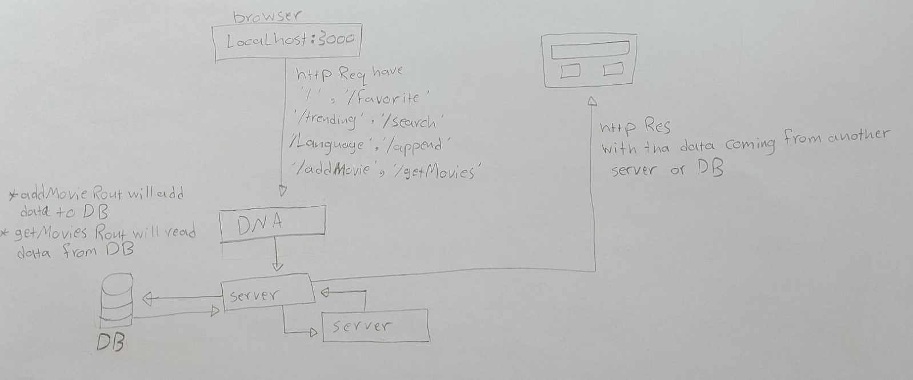

# Movies-Library

# Movies-Library - 03v

**Author Name**: khadyjh AL-abbadi

## WRRC

## Overview

## Getting Started

if you want to use the Movies Library progect first of all you have to clone it in your device then follow this steps:
- install required package using npm install 
- then run the servsr in your device 
- then you can use the browser to test if it work 
- the git method will run on the browser using localhost with the port you run the server in 
- but to run the other method you should use postman app
- (/,/favorite,/search,/trending,/language,/append) to run thise rout in postman you should choose the get method then put the url then send it .
- (/addMovie) well add new movie to the local database // to use thise rout in postman you should choose the post method then the body choose row thin json after that you need to write movie object you want to add in the body then put the url then send it . 
- (/getMovies) well get the added movies from the database //  to run thise rout in postman you should choose the get method then put the url then send it .

## Project Features
no features yet it just use the get method to send data to the user 
use api to fitch data from it then send it to the browser using async methode like axios